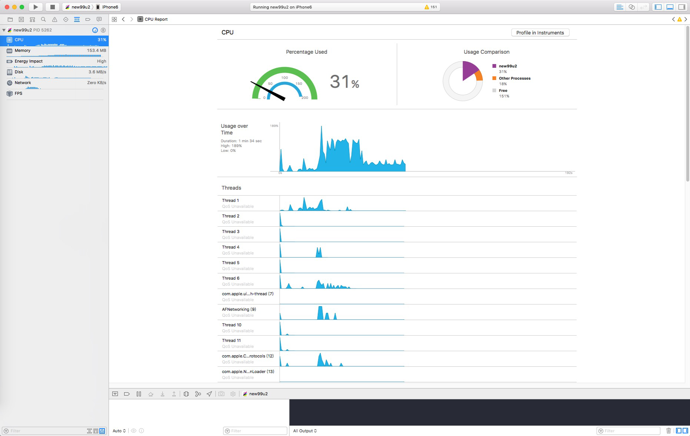
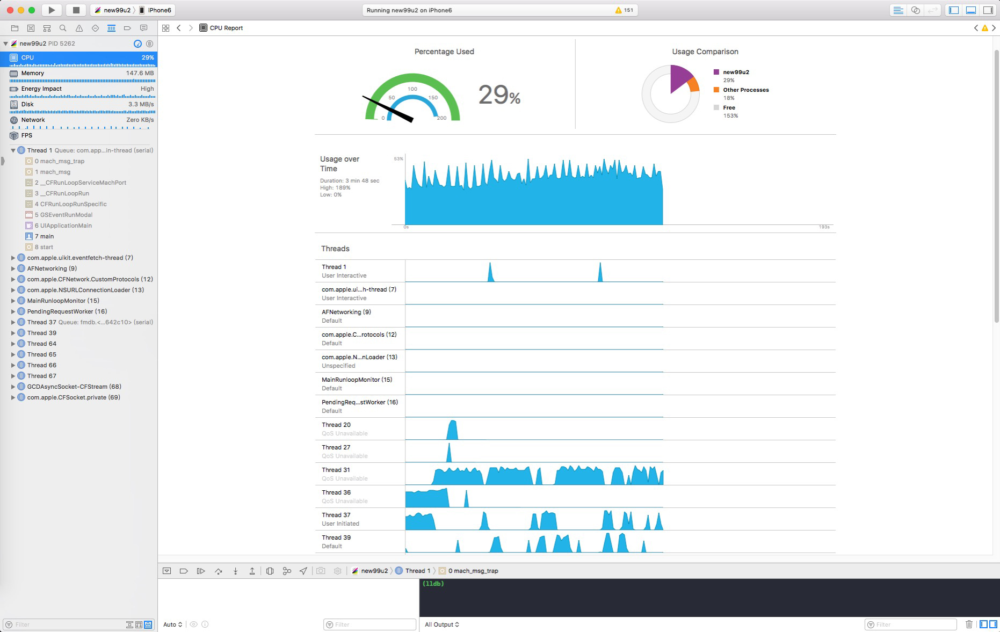
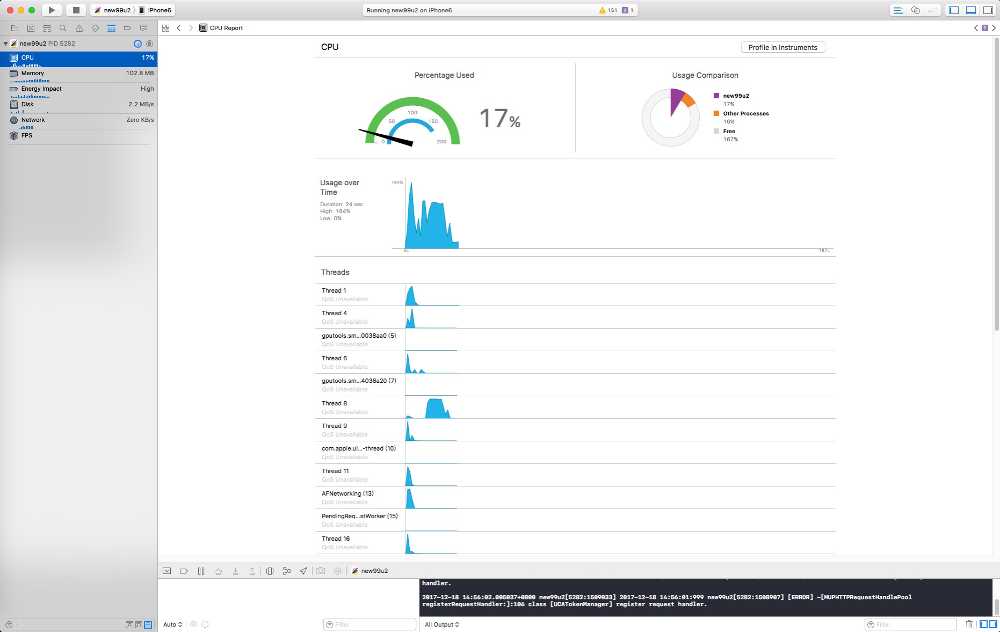
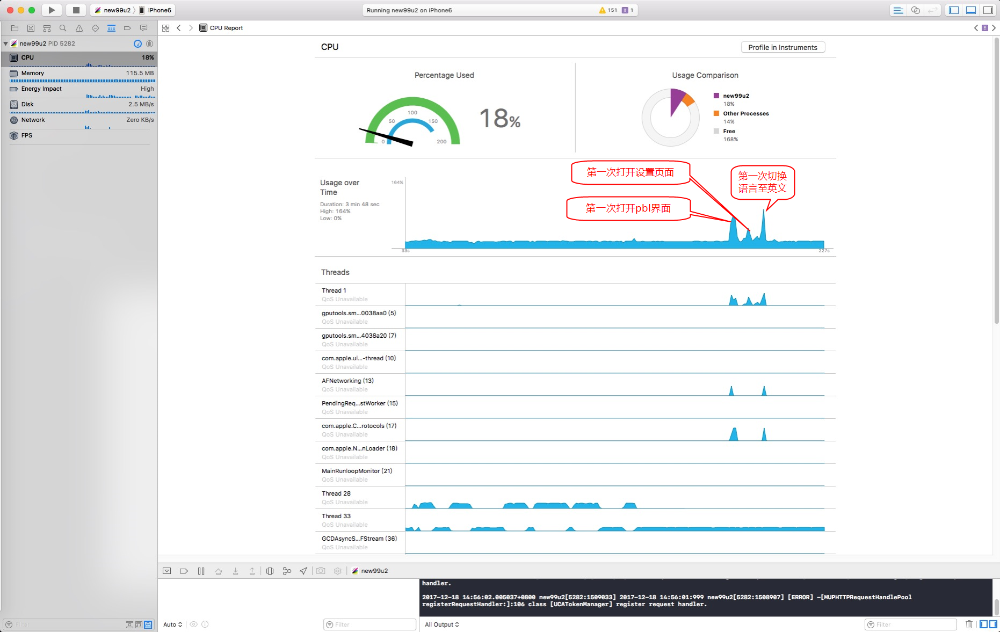

### 99U线程优化问题梳理


#### 测试条件

测试环境：iPhone 6 (真机环境)

测试方式：xcode调试监控app运行情况


#### 测试场景

##### 场景一：安装后首次启动

在登录事件后，CPU使用波峰，使用率达180%+，刷新最近聊天页面时下降至130%，刷新完成后，维持在30%～45%之间。CPU线程存活数最多达45条。没有达到该机型的极限线程数（约68条）。具体CPU使用情况如下图：



App使用稳定后，CPU占用率在30%-50%之间，线程数约15条。

具体CPU使用情况如下图：



##### 场景二：非首次安装冷启动

在自动登录事件后，CPU使用波峰，使用率达160%+，刷新最近聊天页面时下降至130%，刷新完成后，维持在20%～30%之间。CPU线程存活数约35-40条。没有达到该机型的极限线程数（约68条）。具体CPU使用情况如下图：



##### 场景三：线程数稳定后切换语言

在测试过程中，经过一段时间不使用。线程数稳定在15条左右，选择切换语言。

此时，界面跳转至最近聊天列表页面。cpu占用率上升至80%，线程数增加4-10条，属于可以接受范围。



#### 测试问题反馈

安装后首次启动，首次启动到第一个列表数据获取完毕刷新完10-20s左右。
1、会下载9个h5相关的package，并根据Log记录分析推测，应该是在登录之后（此时正处于刷新第一个页面的资源紧张期）进行下载操作、并解压。但实际上这几个package不见得是必须要要更新的。

	1、com.nd.apf.h5.widget.widget
	2、com.nd.social.motionapp
	3、com.nd.social.health-app
	4、com.nd.social.voting
	5、com.nd.sdp.component.h5-notice.local-h5
	6、com.nd.sdp.component.model-app.local-h5
	7、model-resume-app.local-h5
	8、privacy-app.local-h5
	9、green-hand-mission.local-h5
2、[IMSMessageDB addMessage:toConversation:]这个操作在刷新列表时被调用500-1000次（猜测和刷新的聊天记录数有关），在log记录中可以看到一个相关数据，不确定是否时函数执行时长，每次执行时长都在1-10ms级别。如果是该函数每次需要如此长的操作时长，应该考虑优化。

```
2017-12-14 10:49:25.283371+0800 new99u2[5947:58949] 2017-12-14 10:49:25:283 new99u25947:58973 -[IMSMessageDB addMessage:toConversation:]:203 [im.core.nd] addMessage 0.006676

2017-12-14 10:49:25.290551+0800 new99u2[5947:58950] 2017-12-14 10:49:25:290 new99u25947:58973 -[IMSMessageDB addMessage:toConversation:]:203 [im.core.nd] addMessage 0.003314
```

3、每次冷启动99u，会在1s内查询13次cs.101.com的hosts，但实际上从cs中加载的图片数并不多，如果每次调用cs都要查询host，可能意味着要根据host进行地址拼接，是比会增加图片整体获取时长。