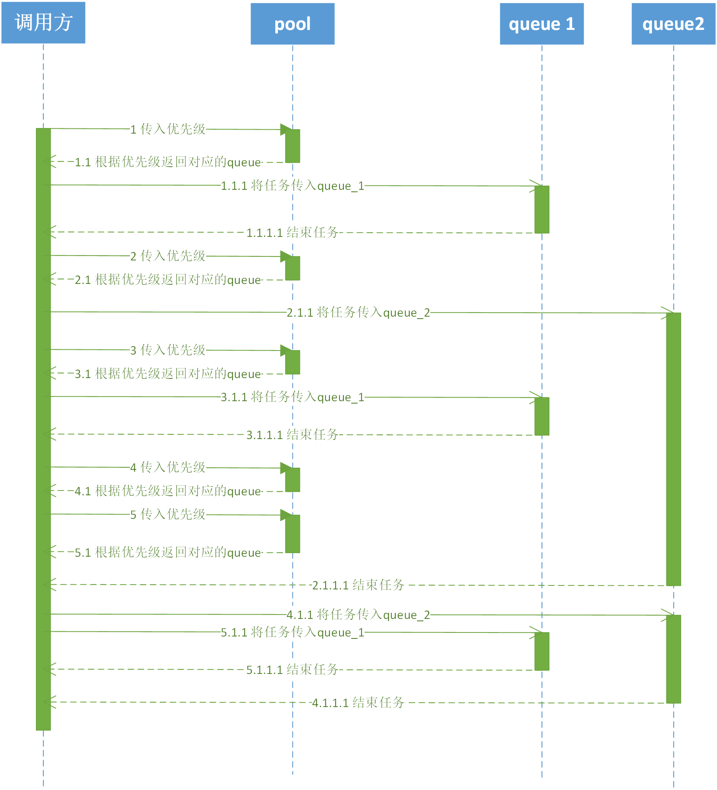
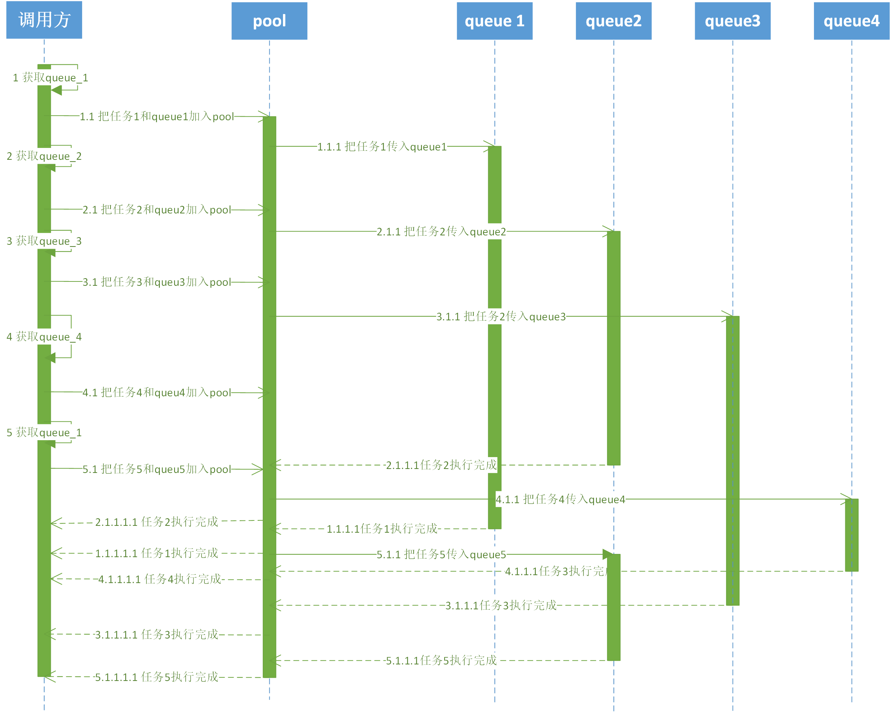

## 基于任务管理的队列池API设计

### 背景

在99u启动的过程中，线程数峰值较大，为了解决线程数峰值问题，可采用控制线程数、队列数、并发任务数来降低线程峰值问题。本文是通过探究第三方库 `YYDispatchQueue`、`QSDispatchQueue`以及 iOS 原生`QSDispatchQueue`并产生一个相对合理的解决方案。

### 现有队列池／线程池概况

#### YYDispatchQueue

##### 流程概要

YYDispatchQueue初始化时设置5个等级的任务优先级，每个任务优先级有对应的优先级上下文。每个任务优先级创建n条串行队列，n等于当前设备活动核心数。优先级上下文具体结构如下：

```obj-c
typedef struct {
    const char *name;		//队列上下文名称
    void **queues;			//队列的指针
    uint32_t queueCount;	//队列总数
    int32_t counter;		//当前所有队列任务数
} YYDispatchContext;
```

开发者只能根据优先级从从队列池取到队列。队列池每次收到获取队列请求后，获取该优先级的队列池上下文，立即将当前队列池任务数自增1后取余队列总数（即从该优先级上下文中获取当前队列的下一条队列，不考虑队列的状态）。

##### 实验设计 

在有8个活动核心数的设备上将1000个异步任务（每个异步任务sleep 0.2～4.2s）加入由YYDispatchQueue管理的默认优先级的serial queue中。

代码如下：

```text
for(int i = 0; i < 1000; i++){
    dispatch_queue_t queue2 = YYDispatchQueueGetForQOS(NSQualityOfServiceDefault);
    NSLog(@"%d:for begin",i);
    dispatch_async(queue2, ^{
        NSLog(@"%d:%@,thread:%@,action begin",i,@"中",[NSThread currentThread]);
        sleep(random()%5+0.2);
        NSLog(@"%d:%@,thread:%@,action end",i,@"中",[NSThread currentThread]);
    });
    NSLog(@"%d:end",i);}
}
```

YYDispatchQueue在加入异步任务的时候就预先分配好了对应的queue，如果该queue现有任务执行时间长，而其他的queue已有的任务执行时间短。则可能产生如下情况：

1、**后加入队列池的任务**在**先加入队列池的任务**之前执行，即**执行顺序不稳定**的情况。

2、有的串行队列处于空闲状态，而有的串行队列处于长时间忙碌的状态

根据log记录可知：

31号任务action begin的时间早于20号任务action begin的时间，所以确实产生了执行顺序不稳定的情况

```text
23:09:25.38 11:中,thread:{number = 9, name = (null)},action begin
23:09:25.38 13:中,thread:{number = 10, name = (null)},action begin
23:09:26.37 11:中,thread:{number = 4, name = (null)},action end
23:09:26.37 19:中,thread:{number = 4, name = (null)},action begin
23:09:26.38 16:中,thread:{number = 8, name = (null)},action end
23:09:26.38 24:中,thread:{number = 8, name = (null)},action begin
23:09:26.38 23:中,thread:{number = 10, name = (null)},action end
23:09:26.38 31:中,thread:{number = 10, name = (null)},action begin
23:09:26.38 31:中,thread:{number = 10, name = (null)},action end
23:09:26.38 39:中,thread:{number = 10, name = (null)},action begin
23:09:27.38 12:中,thread:{number = 5, name = (null)},action end
23:09:27.38 20:中,thread:{number = 5, name = (null)},action begin
23:09:27.38 17:中,thread:{number = 6, name = (null)},action end
23:09:27.38 25:中,thread:{number = 6, name = (null)},action begin
23:09:28.37 19:中,thread:{number = 4, name = (null)},action end
23:09:28.37 10:中,thread:{number = 3, name = (null)},action end
23:09:28.37 14:中,thread:{number = 7, name = (null)},action end
23:09:28.37 27:中,thread:{number = 4, name = (null)},action begin
23:09:28.37 22:中,thread:{number = 7, name = (null)},action begin
23:09:28.37 18:中,thread:{number = 3, name = (null)},action begin
23:09:28.37 27:中,thread:{number = 4, name = (null)},action end
```

为解决该问题。则应该把所有开发者需要用队列执行的异步任务block加入到一个公共队列或者链表中进行管理。然后每个serial queue从中依次取出任务进行执行。

时许图如下：


##### 特征总结：

类型：队列池

优先级划分：5个优先级

池动态扩容：不支持

线程池峰值数：稳定

执行顺序稳定性：不稳定

优点：基于优先级分配队列

缺点：

1、调度能力弱，不能根据队列当前情况进行调度，可能导致执行顺序不稳定的情况。

2、无法动态扩容，队列数稳定，可能需要维持许多空队列。


#### QSDispatchQueue

##### 流程概要

队列池创建一条公共串行队列，用于统一分配所有任务，队列池创建一个公共信号量，用于控制任务并发数。

由开发者创建／获取队列，并把该队列和待执行的任务加入队列池。队列池把待执行任务加入公共串行队列。由公共串行队列等待信号量，将任务交给开发者传入队列池的队列执行。

关键代码如下：

```obj-c
dispatch_async(_serialQueue,^{//将异步任务加入公共队列池
	dispatch_semaphore_wait(self.semaphore, DISPATCH_TIME_FOREVER);//获取信号量
	dispatch_async(self.queue,^{//将异步任务传回开发者队列执行
		if (block) {
			block();
		}
	dispatch_semaphore_signal(self.semaphore);  //释放信号量
	});
})
```

##### 实验设计

新建一个并发队列workConcurrentQueue，将其与1000个一步任务加入到QSDispatchQueue中，并设置最大并发数为8。

QSDispatchQueue会将1000个任务加入到一条串行队列，在获取到信号量之后将任务逐一分配给并发队列workConcurrentQueue。

```Obj-c
dispatch_queue_t workConcurrentQueue = dispatch_queue_create("com.jzp.async.queue", DISPATCH_QUEUE_CONCURRENT);
QSDispatchQueue *queue = [[QSDispatchQueue alloc]initWithQueue:workConcurrentQueue concurrentCount:8];
for (NSInteger i = 0; i < _count; i++) {
	[queue async:^{
		NSLog(@"thread-info:%@开始执行任务%d",[NSThread currentThread],(int)i);
		sleep(random()%4+0.2);
		NSLog(@"thread-info:%@结束执行任务%d",[NSThread currentThread],(int)i);
	}];
}
```

根据log记录可知：

任务在公共串行队列中依序加入到开发者创建的并发队列中。可以绝对保证加入并发队列的时间顺序是稳定的。由于各个并发队列之间调度的稳定性，可能导致先后顺序会略有区别：如log中任务0、1、2的开始执行时间顺序不稳定。若将一个信号量总数条任务称为一组，那么基本不会产生不同组的任务执行顺序不稳定的情况。

```text
09:44:33.95 thread-info:<NSThread: 0x604000470640>{number = 4, name = (null)}开始执行任务1
09:44:33.95 thread-info:<NSThread: 0x600000470b80>{number = 5, name = (null)}开始执行任务2
09:44:33.95 thread-info:<NSThread: 0x600000471680>{number = 3, name = (null)}开始执行任务0
09:44:33.95 thread-info:<NSThread: 0x600000471100>{number = 6, name = (null)}开始执行任务3
09:44:33.95 thread-info:<NSThread: 0x600000470b00>{number = 7, name = (null)}开始执行任务4
09:44:33.95 thread-info:<NSThread: 0x6000004712c0>{number = 8, name = (null)}开始执行任务5
09:44:33.95 thread-info:<NSThread: 0x600000471800>{number = 9, name = (null)}开始执行任务6
09:44:33.95 thread-info:<NSThread: 0x60000046e9c0>{number = 10, name = (null)}开始执行任务7
09:44:33.95 thread-info:<NSThread: 0x60000046e9c0>{number = 10, name = (null)}结束执行任务7
09:44:33.95 thread-info:<NSThread: 0x60000046e9c0>{number = 10, name = (null)}开始执行任务8
09:44:34.95 thread-info:<NSThread: 0x600000470b80>{number = 5, name = (null)}结束执行任务2
09:44:34.95 thread-info:<NSThread: 0x600000470b00>{number = 7, name = (null)}结束执行任务4
09:44:34.95 thread-info:<NSThread: 0x600000470b80>{number = 5, name = (null)}开始执行任务9
09:44:34.95 thread-info:<NSThread: 0x600000470b00>{number = 7, name = (null)}开始执行任务10
09:44:35.01 thread-info:<NSThread: 0x60000046e9c0>{number = 10, name = (null)}结束执行任务8
09:44:35.01 thread-info:<NSThread: 0x60000046e9c0>{number = 10, name = (null)}开始执行任务11
09:44:35.96 thread-info:<NSThread: 0x600000470b80>{number = 5, name = (null)}结束执行任务9
09:44:35.96 thread-info:<NSThread: 0x600000471800>{number = 9, name = (null)}结束执行任务6
09:44:35.96 thread-info:<NSThread: 0x600000471680>{number = 3, name = (null)}结束执行任务0
09:44:35.96 thread-info:<NSThread: 0x600000471680>{number = 3, name = (null)}开始执行任务12
09:44:35.96 thread-info:<NSThread: 0x600000471800>{number = 9, name = (null)}开始执行任务13
09:44:35.96 thread-info:<NSThread: 0x600000470b80>{number = 5, name = (null)}开始执行任务14
09:44:36.95 thread-info:<NSThread: 0x6000004712c0>{number = 8, name = (null)}结束执行任务5
```

时序图如下：



##### 特征：

类型：基于任务调度方式

优先级划分：4个优先级

队列池动态扩容：不作处理

线程池峰值数：相对稳定

执行顺序稳定性：稳定

缺点：

1、由OC编写。

2、虽然提供了四个优先级，但依然由一条公共队列调度，可能产生高优先级任务被阻塞的情况。

3、采用设置n个信号量的方式，可能导致需要n+1个锁的任务发生死锁。

4、在一个信号量大于1的队列池中无法进行一个绝对同步任务，但如果新建一个信号量为1的队列池，并不是一个高效的操作。


### NSOperationQueue

##### 实验设计

新建一个NSOperationQueue，将1000个异步任务交由NSOperationQueue执行。

```obj-c
NSOperationQueue *operationQueue = [[NSOperationQueue alloc]init];
operationQueue.maxConcurrentOperationCount = 8;
for(int i = 0; i < 1000; i++){
	[operationQueue addOperationWithBlock:^{
	NSLog(@"%d:thread:%@,action begin",i,[NSThread currentThread]);
	sleep(10);
	NSLog(@"%d:thread:%@,action end",i,[NSThread currentThread]);
}];
```

根据log记录可知：NSOperationQueue 的执行顺序也相对稳定，采用并发队列的方式执行各个并发任务。

```text
23:21:41.97 6:thread:<NSThread: 0x608000264e40>{number = 9, name = (null)},action begin
23:21:41.97 4:thread:<NSThread: 0x60c00007b340>{number = 7, name = (null)},action begin
23:21:41.97 0:thread:<NSThread: 0x600000467400>{number = 3, name = (null)},action begin
23:21:41.97 1:thread:<NSThread: 0x60400006b800>{number = 6, name = (null)},action begin
23:21:41.97 2:thread:<NSThread: 0x608000263440>{number = 5, name = (null)},action begin
23:21:41.97 5:thread:<NSThread: 0x60c00006bc00>{number = 8, name = (null)},action begin
23:21:41.97 3:thread:<NSThread: 0x608000264600>{number = 4, name = (null)},action begin
23:21:41.97 7:thread:<NSThread: 0x60800006b5c0>{number = 10, name = (null)},action begin
23:21:41.97 1:thread:<NSThread: 0x60400006b800>{number = 6, name = (null)},action end
23:21:41.97 5:thread:<NSThread: 0x60c00006bc00>{number = 8, name = (null)},action end
23:21:41.97 8:thread:<NSThread: 0x60400006b800>{number = 6, name = (null)},action begin
23:21:41.97 9:thread:<NSThread: 0x60400006b840>{number = 11, name = (null)},action begin
23:21:42.98 3:thread:<NSThread: 0x608000264600>{number = 4, name = (null)},action end
23:21:42.98 9:thread:<NSThread: 0x60400006b840>{number = 11, name = (null)},action end
23:21:42.98 4:thread:<NSThread: 0x60c00007b340>{number = 7, name = (null)},action end
23:21:42.98 10:thread:<NSThread: 0x60c00006bc00>{number = 8, name = (null)},action begin
23:21:42.98 11:thread:<NSThread: 0x60c00007b340>{number = 7, name = (null)},action begin
23:21:42.98 12:thread:<NSThread: 0x60400006b840>{number = 11, name = (null)},action begin
23:21:42.98 12:thread:<NSThread: 0x60400006b840>{number = 11, name = (null)},action end
23:21:42.98 13:thread:<NSThread: 0x608000264600>{number = 4, name = (null)},action begin
23:21:43.98 0:thread:<NSThread: 0x600000467400>{number = 3, name = (null)},action end
23:21:43.98 7:thread:<NSThread: 0x60800006b5c0>{number = 10, name = (null)},action end
23:21:43.98 14:thread:<NSThread: 0x60400006b840>{number = 11, name = (null)},action begin
23:21:43.98 15:thread:<NSThread: 0x600000467400>{number = 3, name = (null)},action begin
23:21:44.98 6:thread:<NSThread: 0x608000264e40>{number = 9, name = (null)},action end
23:21:44.98 2:thread:<NSThread: 0x608000263440>{number = 5, name = (null)},action end
23:21:44.98 17:thread:<NSThread: 0x608000264e40>{number = 9, name = (null)},action begin
23:21:44.98 16:thread:<NSThread: 0x60800006b5c0>{number = 10, name = (null)},action begin
23:21:44.98 17:thread:<NSThread: 0x608000264e40>{number = 9, name = (null)},action end
23:21:44.98 18:thread:<NSThread: 0x608000263440>{number = 5, name = (null)},action begin
23:21:44.98 11:thread:<NSThread: 0x60c00007b340>{number = 7, name = (null)},action end
23:21:44.98 15:thread:<NSThread: 0x600000467400>{number = 3, name = (null)},action end
23:21:44.98 10:thread:<NSThread: 0x60c00006bc00>{number = 8, name = (null)},action end
23:21:44.98 20:thread:<NSThread: 0x608000264e40>{number = 9, name = (null)},action begin
23:21:44.98 19:thread:<NSThread: 0x60c00007b340>{number = 7, name = (null)},action begin
23:21:44.98 21:thread:<NSThread: 0x600000467400>{number = 3, name = (null)},action begin
23:21:45.97 8:thread:<NSThread: 0x60400006b800>{number = 6, name = (null)},action end
```

特征：

优点：NSOprationQueue解决了YYDispatchQueue存在的任务执行顺序不稳定问题。

缺点：基于OC的解决方案，不够轻便灵巧。


### 基于任务管理的队列池（自研）

#### dispatchpool

##### 愿景：

1、执行顺序稳定

2、出入参与GCD一致

2、尽可能基于GCD、C++

要求：保留所有GCD添加任务所需参数，参考dispatch API如下：

```obj-c
void dispatch_sync(dispatch_queue_t queue, DISPATCH_NOESCAPE dispatch_block_t block);

void dispatch_async(dispatch_queue_t queue, dispatch_block_t block);

/*
	@param label 队列名称
	@param attr 队列类型
*/
dispatch_queue_t dispatch_queue_create(const char *_Nullable label,	dispatch_queue_attr_t _Nullable attr);

/*
	@param identifier 优先级
	@param flags 
*/
dispatch_queue_t dispatch_get_global_queue(long identifier, unsigned long flags);
```


##### 设计要求

1、为使得API与GCD一致，线程池需提供获取线程的方法。但为使得便于线程管理，应不得让开发者改变获取到的线程的用途。

2、在开发者将所有任务加入到串行队列进行排队之后（该串行队列称之为：**排队队列**），应该对任务进行重新分配和调度。

3、线程应该要执行顺序稳定。所以应采用队列或链表等方式对任务进行管理。

4、所以对于开发者而言使用线程思路应等同于：`dispatch_get_global_queue` + `dispatch_sync`／`dispatch_async`，故应保留identifier和flags，若为了便于任务定位与管理，应加上label参数作为任务标识符

5、应该提供基于优先级的排队策略与调度策略。


##### 设计概要

1、使用信号量限制并发任务数来控制线程峰值：由于GCD是通过队列对线程数的需求来管理线程，所以可以通过控制队列数、队列中的任务总并发数的方式来间接控制线程数。所以在此设计思路下，应该通过信号量等方式控制队列中的任务的总并发数来实现线程数相对稳定的需求。

2、根据不同优先级设置不同串行队列用于任务排队：在任务加入调度池的时候应根据任务的优先级将任务分配到不同的优先级的排队队列中。

3、不同优先级的任务队列应有对应的信号量用于控制并发数：每个任务队列都单独的一个信号量用于控制当前队列任务并发量，这个信号量大小应该从统计中获得数据并设置。

4、由于队列池中的队列基本都属于并发队列或伪串行队列。应该开放出单独的接口用于获取一个真串行队列，允许实现真串行需求。

5、允许开发者自行创建group，同时提供group相关接口，现不针对group中任务做特殊处理，只增加埋点统计，便于此后做进一步开发。


##### API

```obj-c
/*
	创建队列，用于创建真串行队列，或者获取一个全局并发队列，用于替代GCD的dispatch_queue_create接口,便于埋点统计和后续优化。
	@param label 队列名称
	@param attr 队列类型
*/
dispatch_queue_t dispatch_pool_queue_create(const char *_Nullable label,	dispatch_queue_attr_t _Nullable attr);

/*
 获取一个全局并发队列，用于替代GCD的 dispatch_get_global_queue 接口,便于埋点统计和后续优化。
 @param identifier 优先级
 @param flags 保留字段
 */
dispatch_queue_t dispatch_pool_get_global_queue(long identifier, unsigned long flags);

/*
 在pool中加入异步任务，用于替代GCD的 dispatch_queue_async 接口,将任务加入排队队列管理并分发到queue中执行，同时便于埋点统计和后续优化。
 @param queue 队列
 @param block 任务block
 */
void dispatch_pool_queue_async(dispatch_queue_t queue,dispatch_block_t block);

/*
 在pool中加入同步任务，用于替代GCD的 dispatch_queue_sync 接口,将任务加入排队队列管理并分发到queue中执行，同时便于埋点统计和后续优化。
 @param queue 队列
 @param block 任务block
 */
void dispatch_pool_queue_sync(dispatch_queue_t queue,dispatch_block_t block);

/*
 创建一个group，用于替代GCD的 dispatch_group_create 接口，便于埋点统计和后续优化。
 */
dispatch_group_t dispatch_pool_group_create(void);

/*
 在pool中加入异步group任务，用于替代GCD的 dispatch_group_async 接口,将任务加入排队队列管理并分发到queue中执行，同时便于埋点统计和后续优化。
 @param group 组
 @param queue 队列
 @param block 任务block
 */
void dispatch_pool_group_async(dispatch_group_t group,dispatch_queue_t queue,dispatch_block_t block);

/*
 在pool中加入同步group任务，用于替代GCD的 dispatch_group_sync 接口,将任务加入排队队列管理并分发到queue中执行，同时便于埋点统计和后续优化
 @param group 组
 @param queue 队列
 @param block 任务block
 */
void dispatch_pool_group_sync(dispatch_group_t group,dispatch_queue_t queue,dispatch_block_t block);

/*
 增加一个group任务信号量，用于替代GCD的 dispatch_group_enter 接口，便于埋点统计和后续优化
 @param group 组
 */
void dispatch_pool_group_enter(dispatch_group_t group);

/*
 减少一个group任务信号量，用于替代GCD的 dispatch_group_leave 接口，便于埋点统计和后续优化
 @param group 组
 */
void dispatch_pool_group_leave(dispatch_group_t group);

/*
 在group任务完成后回调，用于替代GCD的 dispatch_group_notify 接口，便于埋点统计和后续优化
 */
void dispatch_pool_group_notify(dispatch_group_t group, dispatch_queue_t queue, dispatch_block_t block);
```
