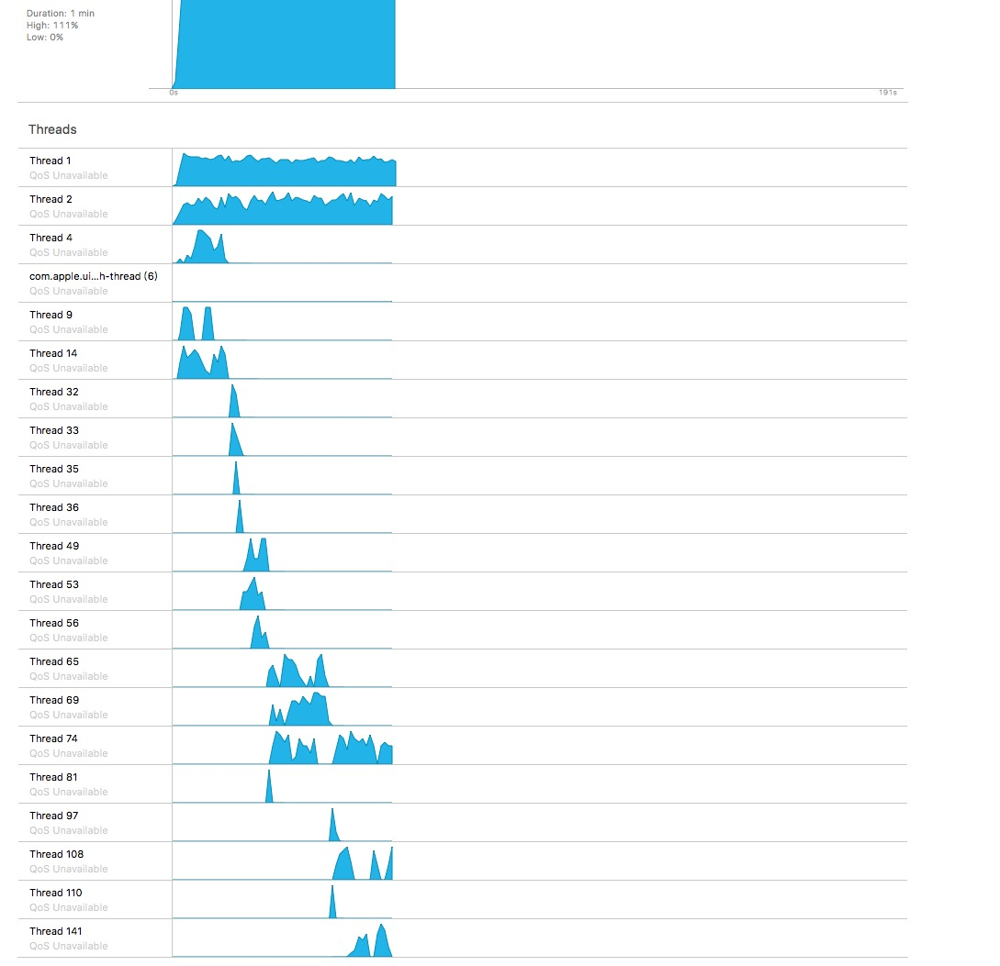

##### Demo测试：

测试1：

数据量：100000
信号量数：100
操作：sleep(0.1)

结果：

|               | 第一次  | 第二次  | 第三次  | 第四次  | 第五次  |
| ------------- | ---- | ---- | ---- | ---- | ---- |
| gcd           |      |      |      |      |      |
| dispatch_pool |      |      |      |      |      |


测试2:

数据量：100000
信号量数：100
操作内容：浮点数计算

```
for(float k = 0.5; k < tag; k = k + 1){
	if(k == tag - 0.5){
		NSLog(@"%@:%d",info,tag);
	}
}
```

结果：

|               |      第一次       |      第二次       | 第三次  | 第四次  | 第五次  | 线程数： |
| ------------- | :------------: | :------------: | :--: | :--: | :--: | ---- |
| gcd           | **65.268337**  |                |      |      |      |      |
| dispatch_pool | **307.983609** | **302.637623** |      |      |      |      |

采用队列池控制20个信号量，执行大量短时间的任务，线程数一般情况下维持在4-20条之间，偶尔有单线程运行的情况，但原生gcd也不能避免该种情况出现。

原生GCD执行，线程数始终维持在60-70之间。




#### 设计方案改进：优化执行时间

##### Demo测试：

测试1：

数据量：100000
信号量数：20
操作：sleep(0.1)

机型：iPhone 6

结果：

|               |     第一次      |      第二次      |      第三次      |      第四次      |      第五次      |
| :------------ | :----------: | :-----------: | :-----------: | :-----------: | :-----------: |
| gcd           | **9.815755** | **11.390528** | **10.081401** | **12.274990** | **9.497438**  |
| dispatch_pool | **9.724804** | **12.139957** | **9.580060**  | **10.562454** | **11.307054** |

测试2：

数据量：100000
信号量数：20
操作内容：数据计算

机型：iPhone 6

```
for(float k = 0.5; k < tag; k = k + 1){
	if(k == tag - 0.5){
		NSLog(@"%@:%d",info,tag);
	}
}
```

结果：

|               |      第一次      |      第二次      |      第三次      |      第四次      |      第五次      |
| :------------ | :-----------: | :-----------: | :-----------: | :-----------: | :-----------: |
| gcd           | **52.580240** | **59.468986** | **53.449162** | **83.204914** | **54.975679** |
| dispatch_pool | **53.603509** | **49.930167** | **52.162689** | **50.650931** | **50.739060** |