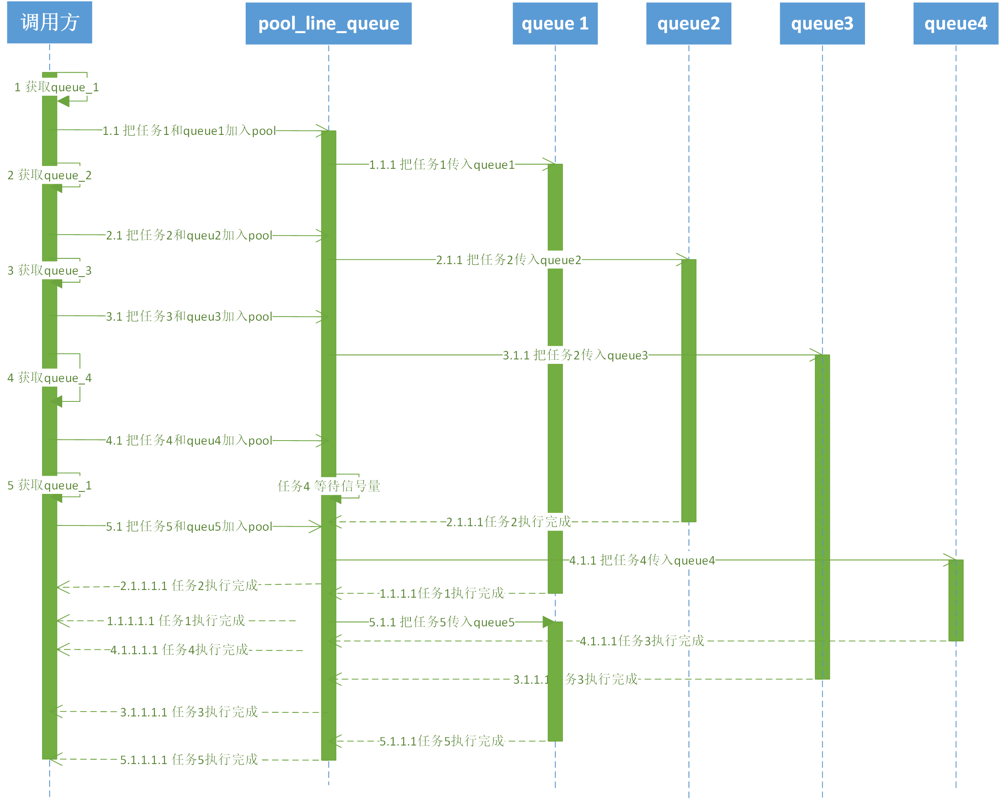
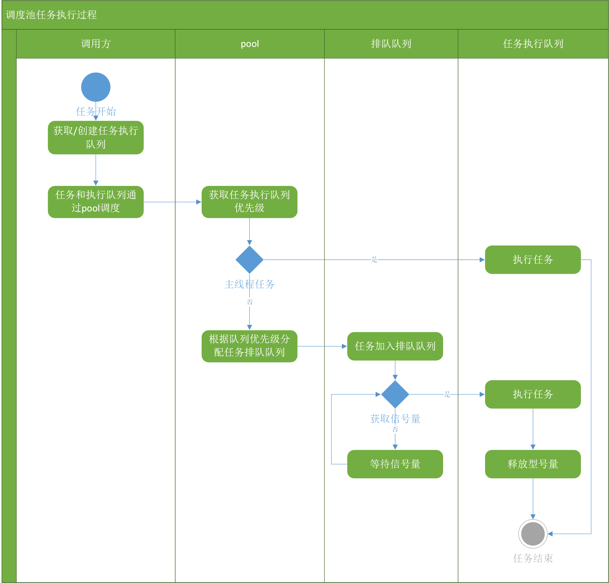

## 多线程优化设计评审

### 背景

在99u等大型App启动的过程中，线程数峰值较大，为了解决线程数峰值问题，可采用控制线程数、队列数、并发任务数来降低线程峰值问题。本次设计是探究第三方库 `YYDispatchQueue`、`QSDispatchQueue`以及 iOS 原生`NSOperationQueue`之后产生一个相对合理的解决方案。

### 设计目标

1、有效控制线程数

2、加入队列池的任务，任务执行顺序不被改变。

3、队列池对外提供的API，出入参与GCD一致；

4、开发上基于GCD、语言上基于C++/C；

5、为了统计开发者的使用API调用情况，应该加上以API埋点，以统计开发者使用习惯，和统计多线程优化结果的关键性能指标。

```Obj-c
/*
	@param label 队列名称
	@param attr 队列类型
*/
dispatch_queue_t dispatch_queue_create(const char *_Nullable label,	dispatch_queue_attr_t _Nullable attr);

/*
	@param identifier 优先级
	@param flags 
*/
dispatch_queue_t dispatch_get_global_queue(long identifier, unsigned long flags);

void dispatch_sync(dispatch_queue_t queue, DISPATCH_NOESCAPE dispatch_block_t block);

void dispatch_async(dispatch_queue_t queue, dispatch_block_t block);

dispatch_group_t dispatch_group_create(void);

dispatch_queue_t dispatch_get_global_queue(long identifier, unsigned long flags);

void dispatch_group_async(dispatch_group_t group, dispatch_queue_t queue, dispatch_block_t block);

void dispatch_pool_group_sync(dispatch_group_t group,dispatch_queue_t queue,dispatch_block_t block);

void dispatch_pool_group_enter(dispatch_group_t group);

void dispatch_pool_group_leave(dispatch_group_t group);

void dispatch_group_notify(dispatch_group_t group, dispatch_queue_t queue, dispatch_block_t block);
```

### 概要设计

​	由于现有方案基本采用基于GCD+C/C++的方向，而GCD本身基于thread进行管理，对开发者提供了queue。为了开发安全起见，该版本的的多线程优化上，不对thread直接进行操作、管理。只基于GCD进行封装、调整条度方式。

​	无论采用线程池、队列池、还是基于任务调度的方案，其目的是为了使基于该方案执行任务时，线程数可控，且应降低线程数峰值。

​	所以本次多线程优化目的有三：

​	1、提供一套方案，可以管理所有通过多线程方式操作的任务。

​	2、降低线程数峰值，

​	3、附加：提供一套统计系统，能够统计开发者使用多线程的操作习惯。

##### 设计方案

任务调度方式：

​	该优化方案是基于的对加入队列中的任务的调度，减少队列中的并发的任务数，从而减少queue中需要开设的线程数。

​	该方案初步是通过信号量的方式，控制并发数，所有加入队列调度池的任务，需要在链表或者、队列中进行排队，在排队过程中获取信号量之后开始执行。

​	在任务执行完成后，释放信号量。

##### API设计

```Obj-c
/*
	创建队列，用于创建真串行队列，或者获取一个全局并发队列，用于替代GCD的dispatch_queue_create接口,便于埋点统计和后续优化。
	@param label 队列名称
	@param attr 队列类型
*/
dispatch_queue_t dispatch_pool_queue_create(const char *_Nullable label,	dispatch_queue_attr_t _Nullable attr);

/*
 获取一个全局并发队列，用于替代GCD的 dispatch_get_global_queue 接口,便于埋点统计和后续优化。
 @param identifier 优先级
 @param flags 保留字段
 */
dispatch_queue_t dispatch_pool_get_global_queue(long identifier, unsigned long flags);

/*
 在pool中加入异步任务，用于替代GCD的 dispatch_queue_async 接口,将任务加入排队队列管理并分发到queue中执行，同时便于埋点统计和后续优化。
 @param queue 队列
 @param block 任务block
 */
void dispatch_pool_queue_async(dispatch_queue_t queue,dispatch_block_t block);

/*
 在pool中加入同步任务，用于替代GCD的 dispatch_queue_sync 接口,将任务加入排队队列管理并分发到queue中执行，同时便于埋点统计和后续优化。
 @param queue 队列
 @param block 任务block
 */
void dispatch_pool_queue_sync(dispatch_queue_t queue,dispatch_block_t block);

/*
 创建一个group，用于替代GCD的 dispatch_group_create 接口，便于埋点统计和后续优化。
 */
dispatch_group_t dispatch_pool_group_create(void);

/*
 在pool中加入异步group任务，用于替代GCD的 dispatch_group_async 接口,将任务加入排队队列管理并分发到queue中执行，同时便于埋点统计和后续优化。
 @param group 组
 @param queue 队列
 @param block 任务block
 */
void dispatch_pool_group_async(dispatch_group_t group,dispatch_queue_t queue,dispatch_block_t block);

/*
 在pool中加入同步group任务，用于替代GCD的 dispatch_group_sync 接口,将任务加入排队队列管理并分发到queue中执行，同时便于埋点统计和后续优化
 @param group 组
 @param queue 队列
 @param block 任务block
 */
void dispatch_pool_group_sync(dispatch_group_t group,dispatch_queue_t queue,dispatch_block_t block);

/*
 增加一个group任务信号量，用于替代GCD的 dispatch_group_enter 接口，便于埋点统计和后续优化
 @param group 组
 */
void dispatch_pool_group_enter(dispatch_group_t group);

/*
 减少一个group任务信号量，用于替代GCD的 dispatch_group_leave 接口，便于埋点统计和后续优化
 @param group 组
 */
void dispatch_pool_group_leave(dispatch_group_t group);

/*
 在group任务完成后回调，用于替代GCD的 dispatch_group_notify 接口，便于埋点统计和后续优化
 */
void dispatch_pool_group_notify(dispatch_group_t group, dispatch_queue_t queue, dispatch_block_t block);
```

### 详细设计

#### 设计方案初版：优化线程数

​	由于开发者的使用习惯不同，所生成、获取的执行队列类型也不同。调度池支持开发者自行创建、获取队列。由于调度池是通过控制信号量的方式来控制并发数。所以无论开发者使用何种queue，原则上来说对调度池的作用并没有影响。所以**允许开发者提供调度队列**。

基本概念：

调用方：需要使用多线程任务的业务方

pool：多线程调度池

line_queue：多线程中的排队队列，加入线程中的所有任务应该由排队队列分配。

执行队列：调用方提供的队列。



加入调度池的任务执行过程。




|      |      |      |      |      |      |
| :--- | :--: | :--: | :--: | :--: | :--: |
|      |      |      |      |      |      |
|      |      |      |      |      |      |
