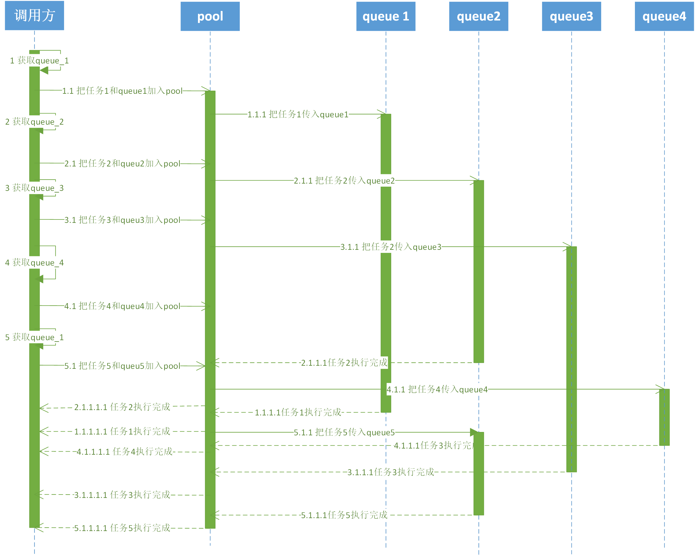

## 多线程优化设计评审

### 背景

在99u等大型App启动的过程中，线程数峰值较大，为了解决线程数峰值问题，可采用控制线程数、队列数、并发任务数来降低线程峰值问题。本次设计是探究第三方库 `YYDispatchQueue`、`QSDispatchQueue`以及 iOS 原生`NSOperationQueue`之后产生一个相对合理的解决方案。

### 设计目标

1、加入队列池的任务，任务执行顺序不被改变。

2、队列池对外提供的API，出入参与GCD一致；

3、开发上基于GCD、语言上基于C++/C；

4、为了统计开发者的使用API调用情况，应该加上以API埋点，以统计开发者使用习惯，和统计多线程优化结果的关键性能指标。

```Obj-c
/*
	@param label 队列名称
	@param attr 队列类型
*/
dispatch_queue_t dispatch_queue_create(const char *_Nullable label,	dispatch_queue_attr_t _Nullable attr);

/*
	@param identifier 优先级
	@param flags 
*/
dispatch_queue_t dispatch_get_global_queue(long identifier, unsigned long flags);

void dispatch_sync(dispatch_queue_t queue, DISPATCH_NOESCAPE dispatch_block_t block);

void dispatch_async(dispatch_queue_t queue, dispatch_block_t block);

dispatch_group_t dispatch_group_create(void);

dispatch_queue_t dispatch_get_global_queue(long identifier, unsigned long flags);

void dispatch_group_async(dispatch_group_t group, dispatch_queue_t queue, dispatch_block_t block);

void dispatch_pool_group_sync(dispatch_group_t group,dispatch_queue_t queue,dispatch_block_t block);

void dispatch_pool_group_enter(dispatch_group_t group);

void dispatch_pool_group_leave(dispatch_group_t group);

void dispatch_group_notify(dispatch_group_t group, dispatch_queue_t queue, dispatch_block_t block);
```

### 概要设计

```Obj-c
/*
	创建队列，用于创建真串行队列，或者获取一个全局并发队列，用于替代GCD的dispatch_queue_create接口,便于埋点统计和后续优化。
	@param label 队列名称
	@param attr 队列类型
*/
dispatch_queue_t dispatch_pool_queue_create(const char *_Nullable label,	dispatch_queue_attr_t _Nullable attr);

/*
 获取一个全局并发队列，用于替代GCD的 dispatch_get_global_queue 接口,便于埋点统计和后续优化。
 @param identifier 优先级
 @param flags 保留字段
 */
dispatch_queue_t dispatch_pool_get_global_queue(long identifier, unsigned long flags);

/*
 在pool中加入异步任务，用于替代GCD的 dispatch_queue_async 接口,将任务加入排队队列管理并分发到queue中执行，同时便于埋点统计和后续优化。
 @param queue 队列
 @param block 任务block
 */
void dispatch_pool_queue_async(dispatch_queue_t queue,dispatch_block_t block);

/*
 在pool中加入同步任务，用于替代GCD的 dispatch_queue_sync 接口,将任务加入排队队列管理并分发到queue中执行，同时便于埋点统计和后续优化。
 @param queue 队列
 @param block 任务block
 */
void dispatch_pool_queue_sync(dispatch_queue_t queue,dispatch_block_t block);

/*
 创建一个group，用于替代GCD的 dispatch_group_create 接口，便于埋点统计和后续优化。
 */
dispatch_group_t dispatch_pool_group_create(void);

/*
 在pool中加入异步group任务，用于替代GCD的 dispatch_group_async 接口,将任务加入排队队列管理并分发到queue中执行，同时便于埋点统计和后续优化。
 @param group 组
 @param queue 队列
 @param block 任务block
 */
void dispatch_pool_group_async(dispatch_group_t group,dispatch_queue_t queue,dispatch_block_t block);

/*
 在pool中加入同步group任务，用于替代GCD的 dispatch_group_sync 接口,将任务加入排队队列管理并分发到queue中执行，同时便于埋点统计和后续优化
 @param group 组
 @param queue 队列
 @param block 任务block
 */
void dispatch_pool_group_sync(dispatch_group_t group,dispatch_queue_t queue,dispatch_block_t block);

/*
 增加一个group任务信号量，用于替代GCD的 dispatch_group_enter 接口，便于埋点统计和后续优化
 @param group 组
 */
void dispatch_pool_group_enter(dispatch_group_t group);

/*
 减少一个group任务信号量，用于替代GCD的 dispatch_group_leave 接口，便于埋点统计和后续优化
 @param group 组
 */
void dispatch_pool_group_leave(dispatch_group_t group);

/*
 在group任务完成后回调，用于替代GCD的 dispatch_group_notify 接口，便于埋点统计和后续优化
 */
void dispatch_pool_group_notify(dispatch_group_t group, dispatch_queue_t queue, dispatch_block_t block);
```

### 详细设计

#### 设计方案初版：优化线程数




Demo测试结果：

|                  |           |           |           |           |           |
| ---------------- | --------- | --------- | --------- | --------- | --------- |
| gcd              | 22.685195 | 22.046736 | 21.773597 | 21.773597 | 316.410215 |
| dispatch_pool_20 | 24.438542 | 23.561325 | 22.607781 | 23.661792 | 341.968153 |

#### 设计方案改进：优化执行时间
Demo测试1：

数据量：100000
信号量数：20
操作：sleep(0.1)
|               |      第一次      | 第二次  | 第三次  | 第四次  | 第五次  |
| :------------ | :-----------: | :--: | :--: | :--: | :--: |
| gcd           | **80.275015** |      |      |      |      |
| dispatch_pool | **39.160026** |      |      |      |      |


<!-- 2017-11-27 20:47:59.594692+0800 GCDDemo[7988:490875] 100000个任务在dispatch_pool中执行时间为:316.410215 -->

数据量：100000
信号量数：20
操作内容：浮点数计算

```
for(float k = 0.5; k < tag; k = k + 1){
	if(k == tag - 0.5){
		NSLog(@"%@:%d",info,tag);
	}
}
```


|               |    第一次    |    第二次    |    第三次    |    第四次    |    第五次    |
| :------------ | :-------: | :-------: | :-------: | :-------: | :-------: |
| gcd           | 22.685195 | 22.046736 | 21.773597 | 21.773597 | 21.586057 |
| dispatch_pool | 36.086456 | 47.465175 | 22.607781 | 23.661792 | 22.338823 |

|               |    第一次    |    第二次    |    第三次    |    第四次    |    第五次    |
| :------------ | :-------: | :-------: | :-------: | :-------: | :-------: |
| gcd           | 22.685195 | 22.046736 | 21.773597 | 21.773597 | 21.586057 |
| dispatch_pool | 24.438542 | 23.561325 | 22.607781 | 23.661792 | 22.338823 |
